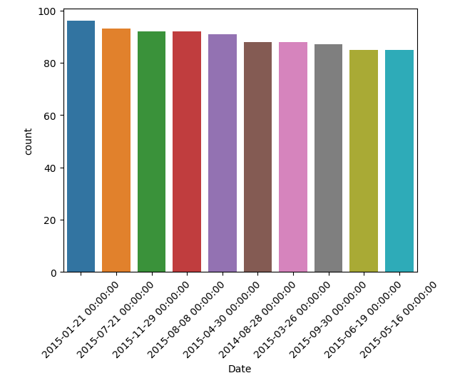
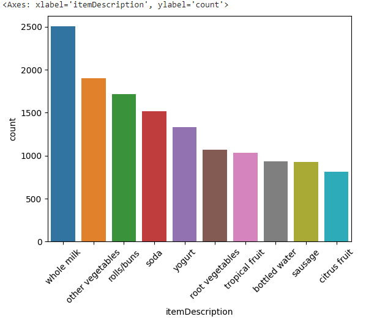
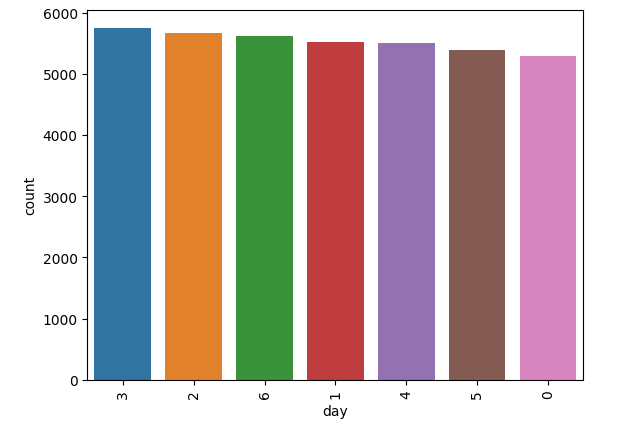
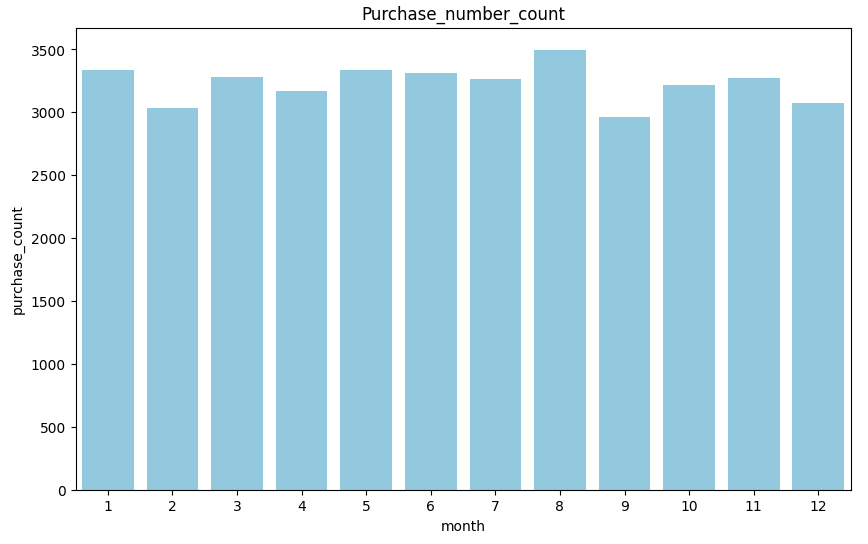
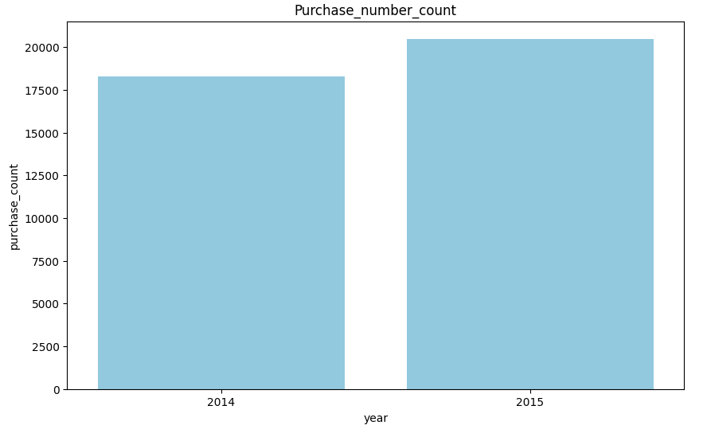
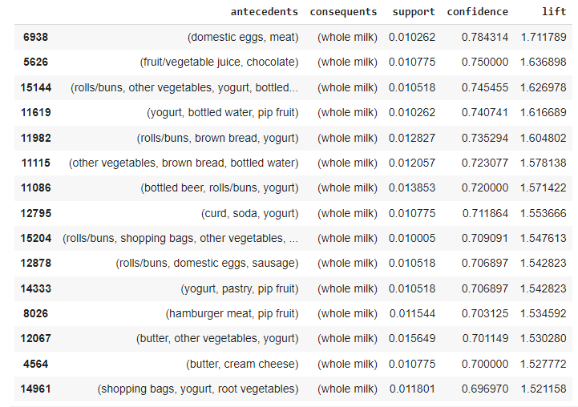

# Laporan Proyek Machine Learning

### Nama : Innayah Azizah Latifah

### Nim : 211351067

### Kelas : TIF Pagi A

## Domain Proyek


Dalam proyek ini, fokusnya adalah menganalisis pola pembelian di sebuah grosir yang menyediakan kebutuhan sehari-hari manusia melalui Market Basket Analisis dengan menggunakan algoritma Apriori. Dengan memanfaatkan teknik Market Basket Analysis, kami dapat mengenali hubungan antara produk, memberikan wawasan lebih mendalam terkait preferensi pelanggan, dan mendukung grosir dalam meningkatkan volume penjualan. Melalui proyek ini, kami berharap dapat mengoptimalkan strategi penjualan, merancang penawaran paket yang menarik, serta meningkatkan kesan positif dalam pengalaman pelanggan.

## Import Library

Pertama-tama import semua library yang dibutuhkan,

```bash
import pandas as pd
import matplotlib.pyplot as plt
import seaborn as sns
import numpy as np
from mlxtend.frequent_patterns import association_rules, apriori
```

## Business Understanding

### Problem Statements

- Ketidakpahaman yang mendalam terhadap pola pembelian yang dilakukan oleh pelanggan.
- Keterbatasan pemahaman ini menjadi tantangan dalam meningkatkan efisiensi strategi penjualan dan memperbaiki pengalaman pelanggan.

### Goals

- Menelusuri produk yang cenderung dibeli secara bersamaan oleh konsumen grosir.
- Menyusun saran strategi pemasaran guna meningkatkan tingkat penjualan dan memberikan pengalaman yang lebih baik kepada pelanggan, berlandaskan hasil Market Basket Analisis.

### Solution statements

- Mengembangkan sistem yang mampu memahami dan menganalisis data (Machine Learning) guna melakukan Market Basket Analisis pada data penjualan produk.
- Sistem berjalan dengan menggunakan algoritma Apriori yang dinilai cocok untuk melakukan Market Basket Analysis pada dataset ini.

## Data Understanding

Dataset yang digunakan berasal dari situs Kaggle. Dataset ini mengandung 38765 entries dan 3 columns

Link Dataset: [Groceries dataset](https://www.kaggle.com/datasets/heeraldedhia/groceries-dataset/data).

Variabel-variabel yang terdapat pada Dataset adalah sebagai berikut:

- Member_number = Id dari customer
- Date = Tanggal Transaksi
- itemDescription = Produk Penjualan

## Data Exploration

Petama-tama kita akan men-definsikan dataset menggunakan fungsi pada library pandas

```bash
df = pd.read_csv('/content/Groceries_dataset.csv')
```

Kita akan melihat isi dari dataset kita menggunakan fungsi df.info(). Berikut adalah data 5 teratas dari dataset kita:

```bash
#   Member_number	Date	    itemDescription
0	1808	      21-07-2015	 tropical fruit
1	2552	      05-01-2015	   whole milk
2	2300	      19-09-2015	   pip fruit
3	1187	      12-12-2015	other vegetables
4	3037	      01-02-2015	   whole milk
```

Kita akan melihat tipe data apa saja yang terdapat dataset kita menggunakan fungsi df.info() dengan hasil sebagai berikut:

```bash
RangeIndex: 38765 entries, 0 to 38764
Data columns (total 3 columns):
 #   Column           Non-Null Count  Dtype
---  ------           --------------  -----
 0   Member_number    38765 non-null  int64
 1   Date             38765 non-null  object
 2   itemDescription  38765 non-null  object
dtypes: int64(1), object(2)
memory usage: 908.7+ KB
```

## EDA

Sebelum kita adakan langkah-langkah untuk menyiapkan data dan membuat model, lebih baik kita mengenali dengan baik dataset yang bakal kita manfaatkan menggunakan teknik Exploratory Data Analysis.


Dari grafik diatas menunjukkan bahwa data penjualan terbanyak adalah pada tanggal 2015-01-21


Dari grafik diatas menunjukkan bahwa data penjualan terbanyak adalah pada item whole milk


Dari grafik diatas menunjukkan bahwa data penjualan terbanyak adalah pada hari kamis


Dari grafik diatas menunjukkan bahwa data penjualan terbanyak adalah pada bulan agustus


Dari grafik diatas menunjukkan bahwa data penjualan terbanyak adalah pada tahun 2015.

## Data Preparation

### Mengganti tipedata kolom Date menjadi Datetime

Kolom Date bertipe data object, untuk dapat mengolah kolom tersebut, kita akan merubah tipe data kolom tersebut menjadi datetime.

```bash
df['Date']=pd.to_datetime(df['Date'], format = "%Y-%m-%d")
```

Kita juga akan memisahkan masing-masing format tanggal tersebut menjadi kolom tersendiri, kita akan membuat kolom month, day, dan year.

```bash
df['month']=df['Date'].dt.month
df['day']=df['Date'].dt.weekday
df['year']=df['Date'].dt.year
```

Berikut adalah dataset kita yang terbaru:

```bash
#  Member_number	    Date	itemDesc..	    month	day	year
0	1808	    2015-07-21	tropical fruit	7	    1	2015
1	2552	    2015-05-01	whole milk	    5	    4	2015
2	2300	    2015-09-19	pip fruit	    9	    5	2015
3	1187	    2015-12-12	other vege...	12	    5	2015
4	3037	    2015-01-02	whole milk	    1	    4	2015
```

### Menyalin dataset

Kita akan membuat variabel dataset baru dengan cara menyalin dataset namun hanya pada kolom itemDescription dan Member_number untuk digunakan sebagai panduan pada proses modelling.

```bash
df = df[['Member_number','itemDescription']].copy()
```

Setelah itu, kita akan menghitung jumlah pembelian pada produk penjualan untuk setiap transaksi.

```bash
item_count = df.groupby(['Member_number','itemDescription'])["itemDescription"].count().reset_index(name="Count")
item_count.head(3)
```

Dengan hasil sebagai berikut:

```bash
#    Member_number	itemDescription	  Count
0	  1000	          canned beer	    1
1	  1000	       hygiene articles	    1
2	  1000	        misc. beverages	    1
9	  1000	          whole milk	    2
```

Setelah itu, kita akan merubah hasil data diatas menjadi berbentuk tabel dengan menggunakan fungsi .pivot_table() dan merubah tipe datanya menjadi integer.

```bash
item_count_pivot = item_count.pivot_table(index='Member_number', columns= 'itemDescription', values = 'Count', aggfunc = 'sum').fillna(0)
item_count_pivot = item_count_pivot.astype('int32')
```

## Modeling

Pada tahap modeling, kita akan menggunakan algoritma apriori dalam melihat asosiasi antar produk. Model ini akan berjalan dengan menggunakan nilai support sebesar 0.01.

Pertama-tama kita akan menampilkan item dengan nilai supportnya.

```bash
support = 0.01
frequent_items = apriori(item_count_pivot, min_support=support, use_colnames=True)
frequent_items.sort_values('support', ascending=False).head(9)
```

Berikut adalah hasil code tersebut:

```bash
#    support	    itemsets
113	0.458184	(whole milk)
68	0.376603	(other vegetables)
83	0.349666	(rolls/buns)
93	0.313494	(soda)
114	0.282966	(yogurt)
105	0.233710	(tropical fruit)
84	0.230631	(root vegetables)
5	0.213699	(bottled water)
88	0.206003	(sausage)
```

Kita mendapatkan data bahwa item whole milk adalah produk dengan nilai suppport terbesar sehingga dapat kita artikan bahwa item tersebut memiliki jumlah penjualan terbanyak sesuai dengan EDA yang telah kita lakukan ditahap sebelumnya.

Lalu berikutnya kita akan melihat asosiasi antar produk dengan menampilkan atribut confidence dan lift

```bash
metric ="lift"
min_threshold = 1

rules = association_rules(frequent_items, metric=metric, min_threshold=min_threshold)[['antecedents','consequents','support','confidence','lift']]
rules.sort_values('confidence', ascending=False,inplace=True)
rules.head(15)
```

Dan mendapatkan hasil sebagai berikut:


Kita melihat bahwa item whole milk yang berperan sebagai consequents memiliki antecendents item domestic eggs dan meat dengan nilai confidence dan lift terbesar diantara lainnya.

## Kesimpulan

dengan ini kita dapat menarik kesimpulan bahwa supermarket ini dapat menerapkan diskon atau paket pembelian untuk produk whole milk, telur kampung, dan daging pada hari Kamis disekitar bulan Agustus


## Deployment

Link Streamlit: https://app-groceries-fnupg4c4nei2kwpaobdmy6.streamlit.app/
